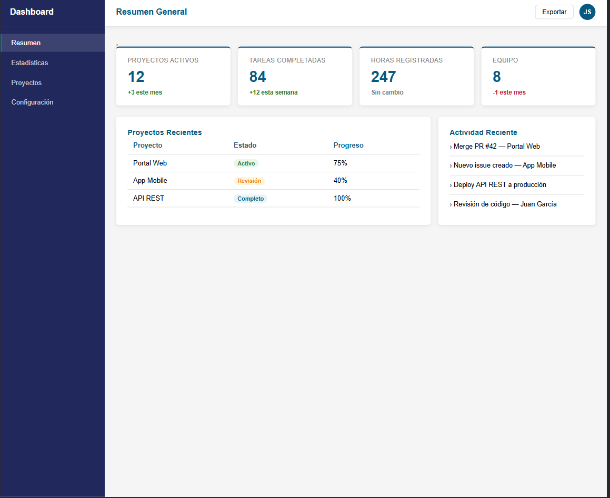
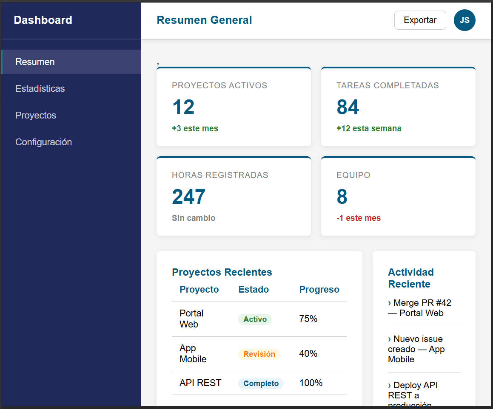

# Proyecto Dashboard Web

**Remolina-post2-u3**  
**Nombre:** Abrahan Remolina Bolívar  
**Código:** 02230131004  
**Unidad:** CSS3 Básico - Post-Contenido 2  

## Descripción del proyecto

Este proyecto consiste en el desarrollo de un dashboard web responsivo utilizando HTML5 y CSS3. Para la construcción del diseño se emplean técnicas modernas como CSS Grid, encargado de la estructura principal, y Flexbox, utilizado para organizar los elementos internos.

El dashboard cuenta con las siguientes secciones:

- Menú lateral de navegación (sidebar)  
- Barra superior con título y opciones  
- Tarjetas con información estadística  
- Tabla con proyectos recientes  
- Sección de actividad reciente  

El objetivo principal es aplicar correctamente Grid y Flexbox sin el uso de frameworks externos, logrando una interfaz clara, funcional y adaptable a distintos dispositivos.

## Tecnologías utilizadas

- HTML5  
- CSS3  
- CSS Grid  
- Flexbox  
- Visual Studio Code  
- Live Server  
- Google Chrome DevTools  
- Git y GitHub  

## Instrucciones de ejecución

1. Clonar o descargar el repositorio en el equipo.  
2. Abrir la carpeta del proyecto en Visual Studio Code.  
3. Asegurarse de tener instalada la extensión Live Server.  
4. Abrir el archivo `index.html`.  
5. Ejecutar con la opción “Open with Live Server”.  

El proyecto se abrirá automáticamente en el navegador.

## Visualización

### Vista en escritorio (1280px)

### Vista en dispositivos móviles (768px o menor)

## Características del diseño

- Uso de CSS Grid para la estructura general  
- Implementación de Flexbox para la distribución de componentes  
- Diseño responsivo mediante `repeat(auto-fill, minmax())`  
- Uso de variables CSS (Custom Properties)  
- Organización de clases siguiendo la metodología BEM  
